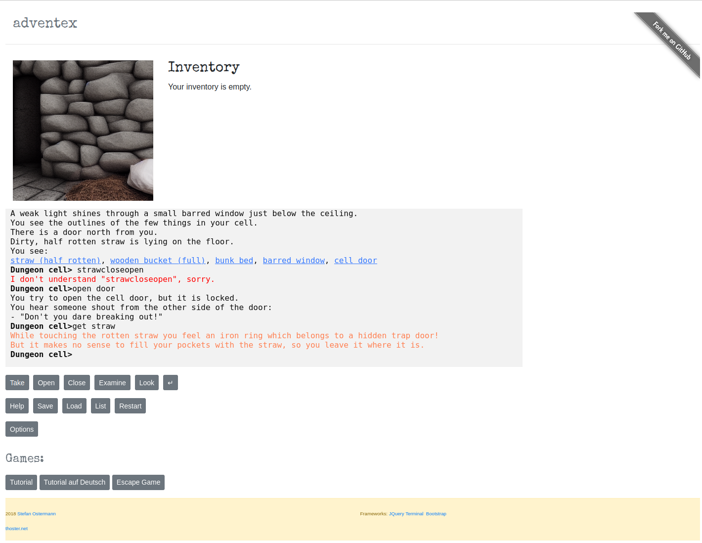

# Adventex

Adventex is a simple interactive fiction (text adventure) game with its own adventure system. The adventure is defined by a couple of JSON files. The game is playable at [thoster.net](https://thoster.net/adventex).

It starts with a demo adventure (kind of an escape room game) and a tutorial.



## Prerequisites

You need Node.js and npm.

## Install

First, you need to install the npm dependencies:
```bash
npm install
```

## Run

You can serve Adventex locally:
```bash
npm run serve
```

or build it with:
```bash
npm run build
```

## Unit Tests

Unit tests only work with a real browser. Start them like this:
```bash
npm run serve-tests
```

## Playing

If you want to learn how to play text adventures, go to "options" and hit "tutorial". This is what you get if you enter *help*:

Most of the time, typing something like *verb object* works. Example: *open door*.

You can go to a possible direction typing *go (direction)*.

You can examine the room or any object typing *examine (object)*. Look around with *look*.

More complex sentences are possible, example: *open box with crowbar*.

Type *inventory* to show all your collected items.

Type *help verbs* to get a list of possible verbs.

## Adventure Creation

Adventures in Adventex are created / edited using JSON files. Below is a detailed explanation of how to set up an adventure.

### Events

Events define the actions and descriptions of different events in the adventure, such as starting the game or interacting with objects.

#### Example: `src/games/tutorial/events.json`

```json
{
    "events": {
        "start_event": {
            "name": "Awake",
            "description": "Welcome to the Adventex tutorial!\nAdventex is a simple text adventure (also called 'interactive fiction').\nYou can:\nExplore different locations, pick up items (into your 'inventory') and interact with objects and the environment to solve puzzles.\nYou interact with your environment by entering simple sentences, starting with a verb.\nFor a list of possible verbs, enter 'help verbs'.\nOften it is useful to examine objects: 'examine table'. If you want to see the description of the current location, enter 'look'.\nSome objects are portable, to pick up a book, enter 'take book'\nStart with exploring your environment by visiting the other room. To do so, enter 'go east'\n",
            "action_move_to_location": "start_location"
        },
        "tutorial_openclose": {
            "name": "Open/Close Tutorial",
            "description": "You can open and close doors and containers. Try 'open door' or 'close chest'.",
            "action_move_to_location": "next_location"
        }
    }
}
```

### Locations

Locations define the different places in the adventure, including their descriptions and possible exits.

#### Example: `src/games/tutorial/locations.json`

```json
{
    "locations": {
        "start_location": {
            "name": "Starting Room",
            "description": "You are in a small, dimly lit room. There is a door to the east.",
            "exits": {
                "east": "next_location"
            },
            "objects": ["book", "table"]
        },
        "next_location": {
            "name": "Next Room",
            "description": "You are in a larger room with a window. There is a door to the west.",
            "exits": {
                "west": "start_location"
            },
            "objects": ["chest", "window"]
        }
    }
}
```

### Verbs

Verbs define the actions that players can perform in the game. They are used to interact with objects and the environment.

#### Example: `src/games/tutorial/verbs.json`

```json
{
    "verbs": {
        "go": {
            "description": "Move to a different location.",
            "action": "move_to_location"
        },
        "take": {
            "description": "Pick up an item.",
            "action": "pick_up_item"
        },
        "examine": {
            "description": "Look at an object or location.",
            "action": "examine_object"
        },
        "look": {
            "description": "Look around the current location.",
            "action": "look_around"
        },
        "open": {
            "description": "Open a door or container.",
            "action": "open_object"
        },
        "close": {
            "description": "Close a door or container.",
            "action": "close_object"
        }
    }
}
```

### Synonyms

Synonyms allow players to use different words for the same action, making the game more flexible and user-friendly.

#### Example: `src/games/tutorial/synonyms.json`

```json
{
    "synonyms": {
        "take": [
            "get",
            "pick"
        ],
        "go": [
            "walk",
            "drive",
            "climb"
        ],
        "look": [
            "watch"
        ],
        "push": [
            "press"
        ],
        "extinguish": [
            "delete"
        ],
        "clean": [
            "wash"
        ],
        "into": [
            "inside"
        ]
    }
}
```

### Key Components

- **Events**: Define the actions and descriptions of different events in the adventure.
- **Locations**: Define the different places in the adventure, including their descriptions and possible exits.
- **Verbs**: Define the actions that players can perform in the game.
- **Synonyms**: Allow players to use different words for the same action, making the game more flexible and user-friendly.

By configuring these JSON files, you can create and customize your own text adventures in Adventex.

If you need any additional details or modifications, feel free to ask!